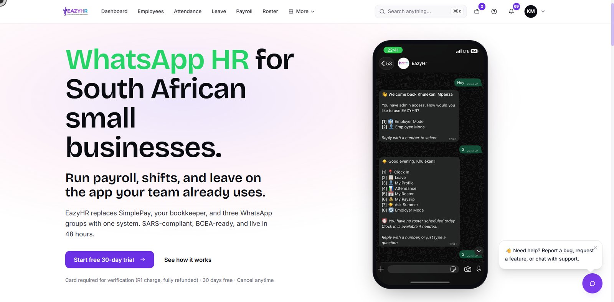

# EazyHR

A multi-tenant HR and payroll platform for South African businesses, where the employee side runs
entirely through one WhatsApp Business contact and the employer side is a web dashboard.

No longer maintained.



## Why WhatsApp

An HR app that employees have to install is an HR app most employees never open. Clocking in
should take one message. So attendance, leave requests, payslips and HR queries all run through a
chat thread people already have open, and the dashboard exists for the person who actually needs a
dashboard — the employer.

The UX rule on the employer side was a three-tap limit: any common action reachable in three taps
or fewer. Employee management, leave and attendance were redesigned around it.

## What it does

- **Users &amp; roles** — Owner, Admin, Employee, Contractor, with permissions per role.
- **Attendance** — check in and out from WhatsApp or the dashboard, with geofence configuration
  and site-based rosters.
- **Leave** — apply, approve and track, with BCEA leave accrual rules.
- **Payroll** — SARS 2025/26 PAYE brackets, UIF, overtime at 1.5× and 2×, pay groups, payslip
  generation and bank file export.
- **Policy builder** — generates OHS, POPIA, disciplinary, harassment, travel, payslip and leave
  policies from company details.
- **Onboarding** — task checklists and document collection for new hires.
- **Documents** — upload, sign and store employee documents.
- **Rosters and projects** — roster planner, sites, contractors, project tracking.
- **Compliance** — BCEA compliance view and a labour audit.
- **Summer AI** — a Gemini-powered HR assistant, with access tiered by plan.
- **Billing** — Starter / Professional / Business / Enterprise tiers through Paystack.

Compliance work here is specific to South Africa: SARS tax tables, UIF, and the Basic Conditions
of Employment Act. A generic payroll engine would have been faster to build and useless to the
customer.

## Architecture

```
src/              React + Vite front end
  pages/Employer/   dashboard, attendance, leave, payroll, policies, roster, compliance
  pages/Auth/ Onboarding/ Public/ SuperAdmin/ Support/ Legal/
server/           Express API
api/              Vercel serverless entry, plus cron jobs and payslip font/WASM assets
shared/           types shared between front end and API
database/         SQL
supabase/         migrations and policies
```

Multi-tenancy is enforced in Postgres with row-level security rather than in application code, so
a missing `WHERE company_id = …` in a query is a failed query rather than a data leak.

## Stack

| | |
| --- | --- |
| Front end | React 18, TypeScript, Vite, Tailwind, shadcn/ui (Radix), dnd-kit |
| API | Express on Vercel functions |
| Data | Supabase Postgres + Storage, row-level security |
| Messaging | Twilio WhatsApp Business API |
| Payments | Paystack |
| AI | Google Gemini |
| Hosting | Vercel, Cloudflare, AWS |

## Status

Archived.

---

<sub>Source is private — this repo is the write-up. [Shaun Madondo](https://github.com/TheC0deJunkie) · Durban, KwaZulu-Natal.</sub>
